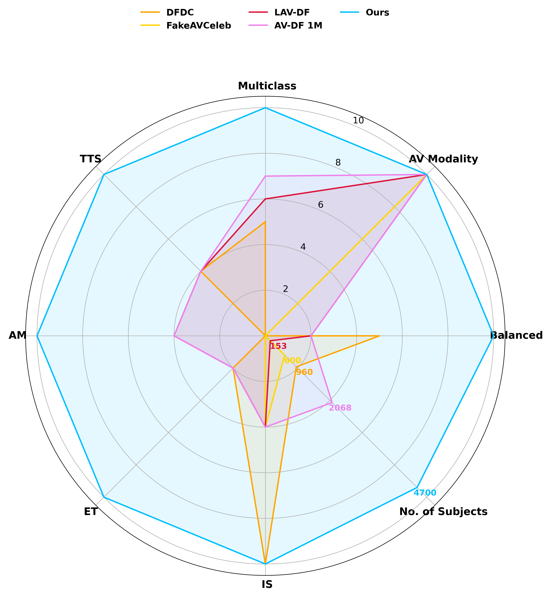

# 🧠 MD3: Toward Next-Generation Multi-Modal Multi-Class Deepfake Detection Benchmark

> **Paper:** _Toward Next-Generation Multi-Modal Deepfake Detection Benchmark_  
> [📄 PDF](https://github.com/adinathdukre/MD3) | [📊 Dataset Info](#dataset-overview) | [📬 Contact](#contact)

---

## ✨ Overview

The **MD3** benchmark introduces a novel, multimodal, and multiclass deepfake detection dataset designed to address critical limitations in existing benchmarks. MD3 is developed to support rigorous evaluation of deepfake detectors under realistic and challenging conditions. This benchmark mitigates several pressing concerns:

1. **Limited Diversity** – Existing datasets primarily address a narrow range of manipulation types, such as face swapping.
2. **Obsolete Techniques** – Most current benchmarks rely on outdated generative models.
3. **Binary Evaluation Paradigm** – Many benchmarks restrict evaluation to binary real-vs-fake classification, whereas MD3 supports fine-grained classification.
4. **Sparse Labeling** – Prior datasets often lack detailed annotations of forgery types.

### Key Contributions:
- ✅ Eight distinct audio-visual manipulation classes
- 🌍 Over 4,700 subjects from 114 countries
- 🧠 Compatibility with both binary and multiclass classification tasks
- 🎯 Benchmarked using eight state-of-the-art (SOTA) detection methods

---

## 📦 Dataset Highlights

The following radar plot illustrates MD3's comparative strengths across multiple dimensions including forgery class coverage, audio-video modality balance, subject diversity, and usage of advanced synthesis techniques.



---

## 📦 Dataset Overview

### 🔹 Forgery Types

| Modality       | Category              | Techniques Utilized                  |
|----------------|-----------------------|--------------------------------------|
| Video          | Identity Swap (IS)    | SimSwap, FaceDancer                  |
| Video          | Expression Transfer   | FOMM, LivePortrait                   |
| Video          | Attribute Manip. (AM) | StyleGANEX, Latent Transformer       |
| Audio          | Voice Cloning (TTS)   | StyleTTS, HierSpeech++               |
| Audio + Video  | Fully Synthetic       | Cross-modality combinations          |

- 🔢 **Real Audio + Real Video:** 40,000 samples sourced from VoxCeleb2
- 🔁 **Synthetic Samples:** 140,000 manipulated videos and 80,000 synthesized audios
- 🧬 Multi-modal, multi-technique generation pipeline encompassing IS, ET, AM, and TTS

### 📊 Dataset Composition


*Figure 1: Visual examples of each class within the dataset.*


*Figure 2: Distribution of samples across forgery classes and subject demographics.*

---

## 📊 Benchmarking Results

### Multiclass Classification (Image-based)

| Model            | Classes | Accuracy | AUC  | Precision | Recall | F1 Score |
|------------------|---------|----------|------|-----------|--------|----------|
| Xception         | 4       | 71.58%   | 0.90 | 72.81     | 71.59  | 71.72    |
| MesoInception4   | 4       | 39.88%   | 0.74 | 53.44     | 39.76  | 35.75    |

### Binary Classification (Audio-Visual)

| Dataset      | Detection Method | Modality | AUC  |
|--------------|------------------|----------|------|
| FakeAVCeleb  | AVFF-CVPR24      | AV       | 99%  |
| **MD3**      | AVFF-CVPR24      | AV       | 87%  |

---

## 🔁 Dataset Construction Methodology

The MD3 dataset is derived from the VoxCeleb2 corpus, containing high-resolution interview recordings of over 6,000 celebrities. To ensure linguistic consistency, the OpenAI Whisper model was employed to filter and retain only English-speaking individuals—a process that required approximately two days using an NVIDIA A6000 GPU with 48GB of memory.

Subsequently, 12 annotators reviewed and selected video segments (1–10 minutes per subject) using a custom video playback interface at 2x speed. The selection criteria emphasized single-person presence, frontal face visibility, absence of obstructions (e.g., hats, glasses), high video quality, and English speech.

A team of four annotators manually stratified the subjects into ethnic groups to ensure balanced demographic representation. In total, over 33,000 high-quality real audio-visual clips were curated.

For synthetic data generation, eight distinct deepfake techniques were employed across both video and audio domains. These manipulations were performed using over 2,000 GPU-hours on A6000 GPUs. To enhance the realism of the manipulations, each target subject was paired with five source identities matched by both gender and ethnicity. The **DeepFace** facial recognition library was employed to compute identity similarity scores, ensuring high facial consistency prior to manipulation. This consistency filtering mitigated the risk of generating low-quality, easily detectable fakes, particularly in cross-ethnic or cross-gender scenarios.

---

## 🏗 Repository Structure

```bash
MD3/
├── dataset/             # Dataset generation scripts and download links
├── models/              # Implementations of detection models (Xception, MesoInception, etc.)
├── results/             # Evaluation metrics and output data
├── assets/              # Visualizations, sample clips, and documentation media
├── requirements.txt     # Required Python packages
└── README.md            # Project description
```

---

## 📬 Contact

For inquiries, collaboration opportunities, or support regarding this dataset, please open an issue or contact the authors via [GitHub](https://github.com/adinathdukre).
